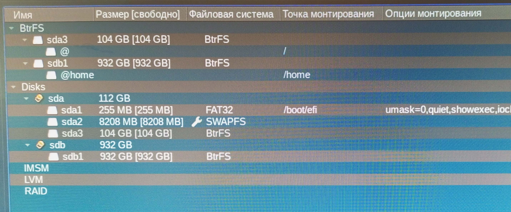

# Восстанавливаем GRUB на BtrFS

Описанное в статье актуально для случаев, когда используется файловая система BtrFS, запись GRUB повреждена или удалена, но сама система цела. Рассмотрим процесс восстановления GRUB на примере. Тестовый стенд и его разметка:

sda - SSD на 120GB. На нем размещены `boot`, `swap` и основная система.

sdb - HDD на 1000GB. Используется только для `home`



Итак, в случае наличия поврежденной записи GRUB мы увидим следующее приветствие:
```
GNU GRUB version...
Minimal BASH-like line editing...
grub>
```

Теперь наша задача войти в систему. Для этого нам потребуется сначала найти директорию `boot` в корневом разделе. Но в GRUB свое обозначение разделов. Выведем список разделов командой `ls` и увидим примерно следующее:
```
(proc) (hd0) (hd0,gpt2) (hd0,gpt1) (hd1) (hd1,gpt3), (hd1,gpt2), (hd1,gpt1) (hd2) (hd2,gpt1)
```

Для того, чтобы разобраться что чем является в нашей файловой системе, в GRUB можно подсмотреть содержимое разделов, используя команду вида `ls (hd#,gpt*)/`, где `#` - номер диска, `*` - номер раздела.

Примеры:

`ls (hd0,gpt2)/`

`grub/ ventoy/ efi/ ENROLL_THIS_KEY_IN_MOKMANAGER.cer tool/` - очевидно мы нашли вставленный в компьютер USB-носитель с Ventoy'ем. Значит, диск hd0 нас больше не интересует

`ls (hd2,gpt1)/`

`@home/` - мы нашли раздел нашего HDD-диска, на котором размещен раздел `/home`. Значит, диск hd2 нас больше не интересует

`ls (hd1,gpt1)/`

`efi/` - судя по ответу, мы нашли раздел sda1 (смотрим разметку в начале статьи). Но он нам сейчас не нужен.

`ls (hd1,gpt2)/`

`error: unknown filesystem.` - здесь мы нашли swap-раздел

`ls (hd1,gpt3)/`

`@/` - мы нашли корневой раздел в BtrFS. Просмотрим содержимое файловой системы, перейдя чуть глубже, используя следующую команду

`ls (hd1,gpt3)/@/`

`dev/ run/ selinux/ boot/ lib/ sbin/ ...` - теперь нам видна структура корневого раздела, в котором также присутствует директория `/boot`.

Теперь наша задача найти и указать GRUB путь к образу ядра Linux, путь к корневому разделу (мы уже знаем, что это будет `root=/dev/sda3`) и путь к образу Initrd. Для этого еще углубимся в файловую систему

`ls (hd1,gpt3)/@/boot/`

`System.map-6.1.57-un-def-alt1 initrd-un-def.img initrd.img vmlinuz`
`initrd-6.1.57-un-def-alt1.img grub/ vmlinuz-6.1.57-un-def-alt1 vmlinuz-un-def`
`splash/ memtest-6.20.bin config-6.1.57-un-def-alt1 efi/ memtest-6.20.efi` - здесь мы нашли искомое и в следующих командах сможем точь-в-точь переписать пути к образу ядра (`vmlinuz-6.1.57-un-def-alt1`) и к образу initrd (`initrd-6.1.57-un-def-alt1.img`)
<br><br><br>
`linux (hd1,gpt3)/@/boot/vmlinuz-6.1.57-un-def-alt1`

`root=/dev/sda3`

`initrd (hd1,gpt3)/@/boot/initrd-6.1.57-un-def-alt1.img`

`boot`

После выполнения последней команды система начнет загружаться и мы сможем войти в нее. Войдя в Параметрах системы KDE/Рабочая среда/Запуск и завершение/Загрузчик GRUB2 мы увидим то, что записей нет. Это говорит о том, что мы вошли в систему, но конфигурация GRUB автоматически не записалась. То есть если ничего не изменить, то при следующей перезагрузке мы попадем в GRUB. Для исправления ситуации устанавливаем GRUB

`apt-get install grub`

После установки GRUB, он автоматически создаст и сохранит конфигурацию. Увидеть это можно будет вновь зайдя в Параметрах системы KDE/Рабочая среда/Запуск и завершение/Загрузчик GRUB2. На этом восстановление поврежденной записи GRUB будет завершено
